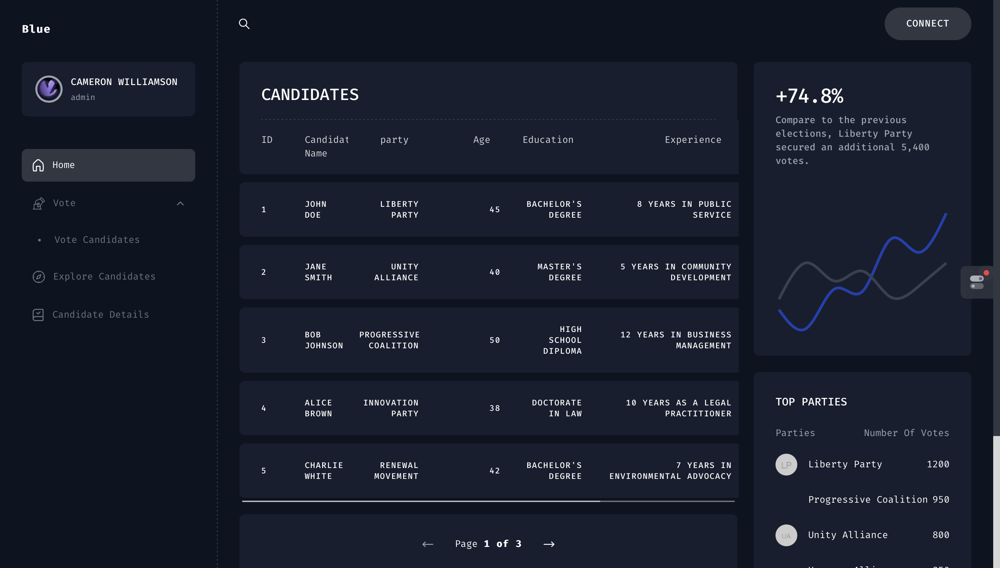

# 🗳️ Blue-Blockchain-Voting-Application

A cutting-edge, blockchain-based voting system leveraging Web3 technology for secure and transparent elections. 🔐🌐



## 🏆 Achievements

- 🥉 Won 3rd place in the NIT Trichy Hackathon!

## 🚀 [Live Demo](https://main.dj874g7rf0kgd.amplifyapp.com)

Experience the future of voting firsthand!

## 🛠️ Technologies Used

- Frontend: Next.js 🖥️
- Smart Contract: Solidity with Hardhat 📜
- Blockchain: COSVM Network 🔗

## ✨ Features

- Blockchain-based voting system ensuring transparency and security
- One token, one vote mechanism 🎫
- Web3 integration for seamless blockchain interactions

## 🔧 Installation

To get started with the Blue-Blockchain-Voting-Application, follow these steps:

1. Clone the repository:
   ```
   git clone https://github.com/sriramsenthill/Blue-Blockchain-Voting-Application.git
   ```
2. Navigate to the project directory:
   ```
   cd Blue-Blockchain-Voting-Application
   ```
3. Install dependencies:
   ```
   npm i --legacy-peer-deps
   ```
4. Run the development server:
   ```
   npm run dev
   ```
5. To build for production:
   ```
   npm run build
   ```

## 🌟 About the Project

This innovative voting system was developed for the NIT Trichy Hackathon, showcasing the power of blockchain technology in creating secure and transparent voting processes. By utilizing the COSVM network for deployment, we've created a decentralized application that ensures the integrity of each vote.

## 🤝 Contributing

We welcome contributions to the Blue-Blockchain-Voting-Application! Feel free to submit issues, feature requests, or pull requests to help improve this project.

## 📄 License

This project is licensed under the MIT License - see the [LICENSE.md](LICENSE.md) file for details.

## 📞 Contact

For any questions or feedback, please reach out to Senthilnathan S at [mail](sriram.senthilnathan@gmail.com).

---

Happy Voting! 🎉🗳️
